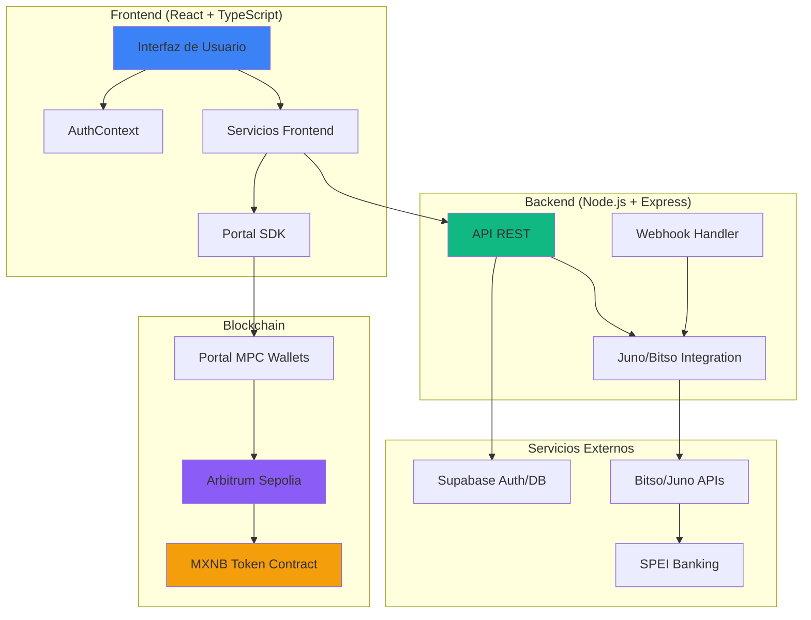
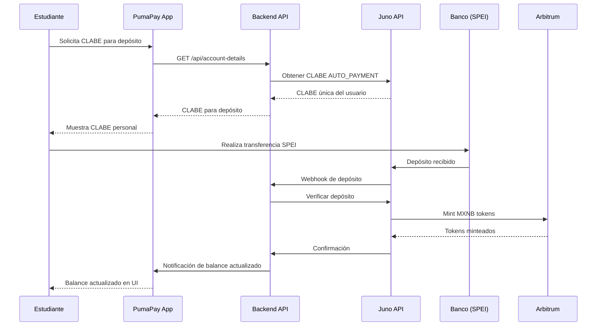
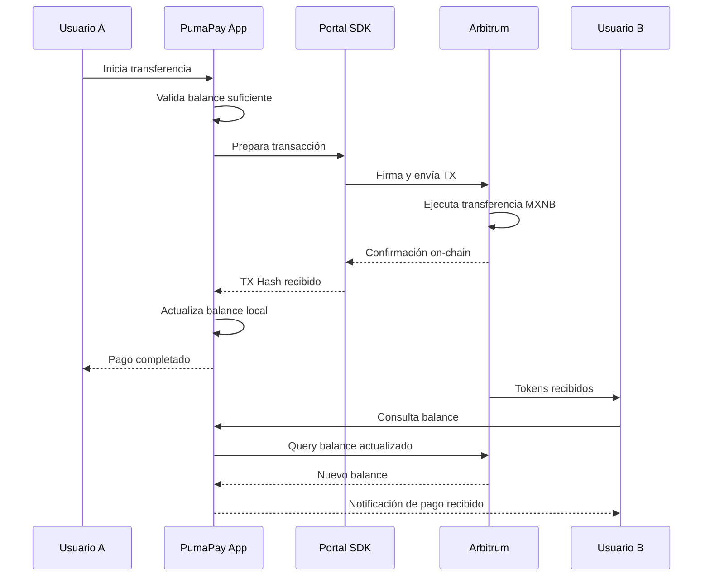
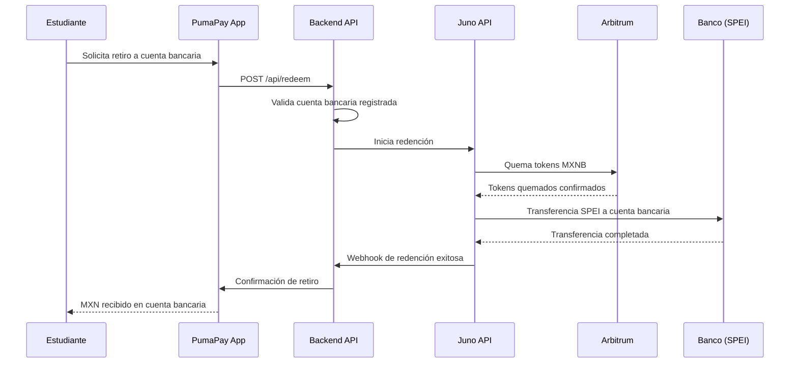
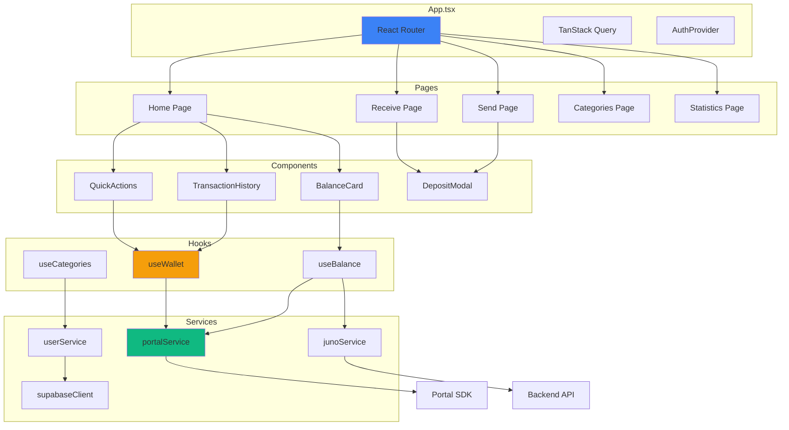
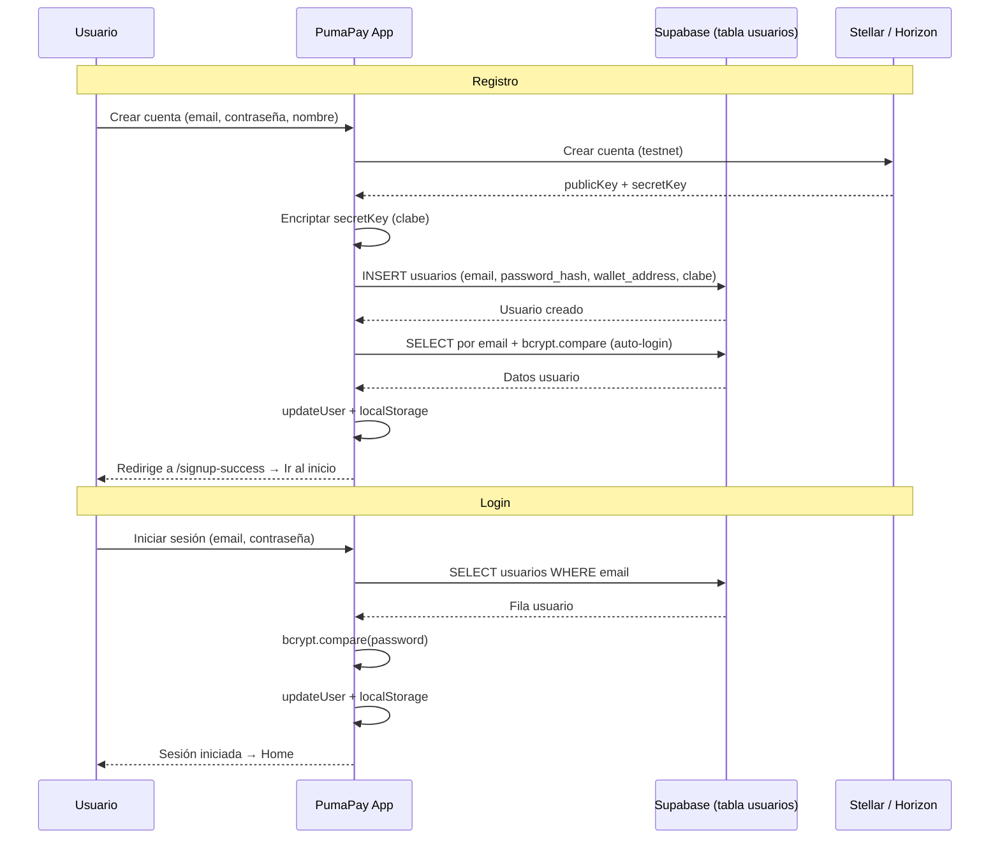
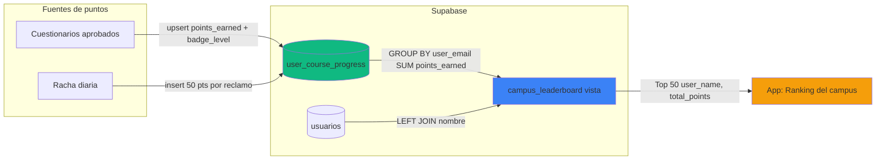
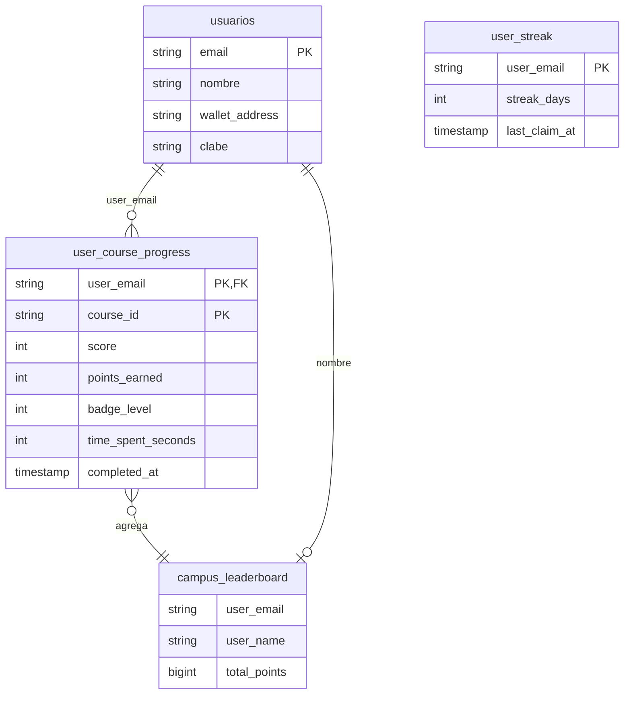
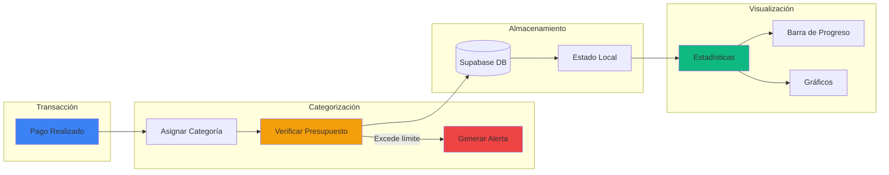

# PumaPay Campus Wallet 🏛️

Una wallet digital universitaria moderna que permite a los estudiantes de la UNAM realizar pagos con tokens MXNB (Mexican Peso Backed) en el campus universitario.

## ✅ MVP (Estado actual)

El MVP incluye:

- **Autenticación**: Registro e inicio de sesión con la tabla `usuarios` en Supabase (bcrypt). Sin Supabase Auth.
- **Wallet Stellar**: Creación de cuenta Stellar (testnet) al registrarse; envío/recibo de pagos.
- **Guías de estudio y cuestionarios**: Cursos por categoría, cuestionarios por guía, insignias (Bronze 50 pts, Silver 75 pts, Gold 100 pts).
- **Puntaje y leaderboard**: Puntos por cuestionarios aprobados y por racha diaria; ranking del campus (Top 50) con nombre del usuario.
- **Racha diaria**: Reclamar 50 puntos cada 24 h; suma al total y al leaderboard vía `user_course_progress`.
- **Feed del campus**: Publicaciones y comentarios para la comunidad universitaria.

## 🌟 Características Principales

### 💰 Gestión de Dinero Digital
- **Tokens MXNB**: Utiliza tokens respaldados por pesos mexicanos en la blockchain Arbitrum
- **Depósitos SPEI**: Convierte automáticamente MXN a MXNB mediante depósitos bancarios
- **Retiros Bancarios**: Convierte MXNB de vuelta a MXN en tu cuenta bancaria
- **Balance en Tiempo Real**: Visualización instantánea de saldos y transacciones

### 🏫 Ecosistema Universitario
- **Mapa del Campus**: Descubre lugares que aceptan PumaPay en Ciudad Universitaria
- **Descuentos Exclusivos**: Hasta 30% de descuento en comercios afiliados
- **QR Codes**: Pagos rápidos escaneando códigos QR
- **Categorización**: Organiza gastos por categorías (comida, transporte, libros, etc.)

### 📊 Análisis Financiero
- **Presupuesto Mensual**: Control de gastos con límites personalizables
- **Estadísticas Detalladas**: Gráficos de gastos por categoría y tiempo
- **Historial Completo**: Seguimiento de todas las transacciones
- **Progreso Visual**: Barras de progreso y métricas en tiempo real

### 🎓 Educación Financiera y Ahorro (En Desarrollo)
- **Metas de Ahorro**: Establece y alcanza objetivos financieros con verificación ZK
- **Zero-Knowledge Proofs**: Demuestra cumplimiento de metas sin revelar datos privados
- **Rankings Anónimos**: Compara tu progreso con otros estudiantes sin comprometer privacidad
- **Badges y Recompensas**: Sistema de gamificación basado en comportamiento financiero responsable
- **DeFindex Integration**: Analytics agregados del campus para educación comparativa
- **Verificación de Presupuesto**: Prueba cumplimiento de presupuesto sin exponer gastos detallados

> **Nota**: Las funcionalidades de ZK Proofs y educación financiera están en desarrollo activo como parte de la migración a Stellar. Ver [Plan de Implementación ZK Proofs](./docs/ZK_PROOFS_PLAN.md) para más detalles.

## 🛠️ Tecnologías Utilizadas

### Frontend
- **React 18** con TypeScript
- **Vite** para desarrollo rápido
- **Tailwind CSS** para estilos
- **Radix UI** para componentes accesibles
- **React Router** para navegación
- **TanStack Query** para manejo de estado del servidor

### Backend y datos (MVP)
- **Supabase**: Base de datos (tabla `usuarios` para auth con bcrypt, `user_course_progress`, `user_streak`, vista `campus_leaderboard`). Sin Supabase Auth.
- **Stellar / Horizon**: Cuentas y transacciones en testnet; creación de wallet al registrarse.

### Blockchain (MVP)
- **Stellar (testnet)** para cuentas y pagos; secret key encriptada en Supabase (campo `clabe`).
- **Arbitrum / Juno / Portal** en documentación para futuras integraciones MXNB.

### Zero-Knowledge Proofs (En Desarrollo)
- **Noir** para circuitos de verificación
- **Ultrahonk** para verificación de proofs en Soroban
- **ZK Proofs** para privacidad en metas de ahorro y presupuestos
- **DeFindex** para analytics agregados y rankings anónimos

## 🚀 Instalación y Configuración

### Prerrequisitos
- Node.js 16+ 
- npm o yarn
- Cuenta de Bitso/Juno para APIs
- Wallet de Ethereum (MetaMask recomendado)

### 1. Clonar el Repositorio
```bash
git clone https://github.com/tu-usuario/puma-pay-campus-wallet.git
cd puma-pay-campus-wallet
```

### 2. Instalar Dependencias
```bash
# Frontend
npm install

# Backend
cd backend
npm install
```

### 3. Configurar Variables de Entorno

#### Frontend (.env) — MVP
```env
VITE_SUPABASE_URL=https://tu-proyecto.supabase.co
VITE_SUPABASE_ANON_KEY=tu_anon_key
VITE_ENCRYPTION_KEY=clave_para_encriptar_secret_stellar
# Stellar: la app usa testnet por defecto (stellarService)
```

#### Backend (.env)
```env
BITSO_APIKEY=tu_bitso_api_key
BITSO_SECRET_APIKEY=tu_bitso_secret
NODE_ENV=development
PORT=4000
```

### 4. Ejecutar en Desarrollo

#### Terminal 1 - Backend
```bash
cd backend
npm run dev
```

#### Terminal 2 - Frontend
```bash
npm run dev
```

La aplicación estará disponible en:
- Frontend: http://localhost:5173
- Backend: http://localhost:4000

## 📱 Funcionalidades Detalladas

### 🏠 Dashboard Principal
- **Balance MXNB**: Saldo actual en tiempo real
- **CLABE Personal**: Para recibir depósitos SPEI
- **Gráfico Semanal**: Visualización de gastos por día
- **Acciones Rápidas**: Enviar y recibir dinero
- **Transacciones Recientes**: Historial de movimientos

### 💸 Gestión de Pagos
- **Enviar Dinero**: Transferencias a otros estudiantes
- **Recibir Dinero**: Generar códigos QR para cobros
- **Pagos en Campus**: Escanear QR en comercios afiliados
- **Historial Completo**: Todas las transacciones con detalles

### 🗺️ Mapa del Campus
- **Lugares Afiliados**: Comercios que aceptan PumaPay
- **Descuentos Activos**: Ofertas especiales por ubicación
- **Navegación**: Integración con Google Maps
- **Filtros**: Por tipo de comercio (comida, libros, deportes, etc.)

### 📊 Categorías y Presupuesto
- **Categorías Personalizables**: Crear y editar categorías de gastos
- **Presupuesto Global**: Límite mensual configurable
- **Progreso Visual**: Barras de progreso por categoría
- **Alertas**: Notificaciones cuando se excede el presupuesto

### 📈 Estadísticas
- **Gastos por Categoría**: Distribución de gastos
- **Tendencias Temporales**: Evolución de gastos en el tiempo
- **Comparativas**: Mes actual vs meses anteriores
- **Exportar Datos**: Descargar reportes en PDF

## 🔧 APIs y Servicios

### Juno APIs (Bitso)
- **Issuance**: Creación de tokens MXNB desde depósitos SPEI
- **Redemption**: Conversión de MXNB a MXN
- **Balance**: Consulta de saldos en tiempo real
- **Transacciones**: Historial completo de movimientos

### Portal SDK
- **Wallet MPC**: Creación automática de wallets
- **Transacciones On-chain**: Envío de tokens MXNB
- **Balance Real**: Consulta de balances desde blockchain
- **Recovery**: Recuperación de wallets con contraseña

## 🏗️ Arquitectura del Proyecto

```
puma-pay-campus-wallet/
├── src/
│   ├── components/          # Componentes reutilizables
│   ├── pages/              # Páginas principales
│   ├── services/           # Servicios de API
│   ├── hooks/              # Custom hooks
│   ├── contexts/           # Context providers
│   ├── types/              # Definiciones TypeScript
│   └── lib/                # Utilidades
├── backend/
│   ├── index.js           # Servidor Express
│   ├── bitso-webhook.js   # Webhooks de Bitso
│   └── package.json
├── public/                   # Assets estáticos
└── api/                    # Endpoints de Vercel
```

## 📊 Diagramas de Arquitectura

Los diagramas **6 a 10** describen los flujos del MVP: autenticación con tabla `usuarios`, cuestionarios e insignias, racha diaria, leaderboard y modelo de datos de gamificación.

### 1. Arquitectura General del Sistema



### 2. Flujo de Depósito (SPEI → MXNB)



### 3. Flujo de Pago/Transferencia



### 4. Flujo de Retiro (MXNB → MXN)



### 5. Arquitectura de Componentes Frontend



### 6. Flujo de Autenticación (MVP: tabla usuarios + Stellar)



### 7. Flujo de Cuestionarios y Puntaje

```mermaid
sequenceDiagram
    participant User as Estudiante
    participant App as PumaPay App
    participant Quiz as QuizComponent
    participant QuizSvc as quizService
    participant Gamification as courseGamificationService
    participant Progress as useCourseProgress
    participant Supabase as Supabase (user_course_progress)
    
    User->>Quiz: Responde cuestionario y envía
    Quiz->>QuizSvc: submitQuiz(courseId, answers, timeSpentSeconds)
    QuizSvc->>QuizSvc: calculateScore → badgeLevel 1|2|3 (Bronze/Silver/Gold)
    QuizSvc-->>Quiz: QuizResult (score, badgeLevel, passed)
    
    alt Aprobado (passed) con badgeLevel
        Quiz->>Progress: recordCompletion(courseId, score, badgeLevel, timeSpentSeconds)
        Progress->>Gamification: recordCourseCompletion(userId, courseId, score, badgeLevel)
        Gamification->>Gamification: calculatePoints(badgeLevel): Bronze=50, Silver=75, Gold=100
        Gamification->>Gamification: localStorage (badges, totalPoints)
        Progress->>Supabase: upsertCourseProgress(user_email, course_id, score, points_earned, badge_level, time_spent_seconds)
        Supabase-->>Progress: OK
        Progress-->>Quiz: Éxito
        Quiz-->>User: Insignia + puntos; leaderboard se actualiza
    end
```

### 8. Flujo de Racha Diaria (Streak)

```mermaid
sequenceDiagram
    participant User as Estudiante
    participant App as PumaPay App
    participant StreakSvc as streakService
    participant Supabase as Supabase
    
    User->>App: Reclamar premio de racha (botón cada 24 h)
    App->>StreakSvc: claimStreakReward(userEmail)
    StreakSvc->>Supabase: SELECT user_streak (streak_days, last_claim_at)
    Supabase-->>StreakSvc: Datos actuales
    
    alt Han pasado ≥ 24 h desde last_claim_at
        StreakSvc->>Supabase: INSERT user_course_progress (50 pts, course_id único por reclamo)
        StreakSvc->>Supabase: UPSERT user_streak (streak_days+1 o 1, last_claim_at=now)
        Supabase-->>StreakSvc: OK
        StreakSvc-->>App: success, pointsAwarded=50
        App-->>User: +50 pts; racha actualizada (cuenta en leaderboard)
    else Aún no pasan 24 h
        StreakSvc-->>App: canClaim=false, nextClaimAt
        App-->>User: "Podrás reclamar en X"
    end
```

### 9. Leaderboard y Origen de Puntos



### 10. Modelo de datos: gamificación y leaderboard



### 11. Flujo de Categorización y Presupuesto



## 🔐 Seguridad

- **Wallets MPC**: Sin necesidad de manejar claves privadas
- **Autenticación OAuth**: Login con Google/Apple
- **Validación CLABE**: Verificación de cuentas bancarias mexicanas
- **Webhooks Seguros**: Notificaciones encriptadas
- **Rate Limiting**: Protección contra ataques

## 🚀 Deployment

### Vercel (Recomendado)
```bash
# Instalar Vercel CLI
npm i -g vercel

# Deploy frontend
vercel

# Deploy backend
cd backend
vercel
```

### Variables de Entorno en Producción
```env
# Frontend
VITE_PORTAL_API_KEY=prod_portal_key
VITE_BACKEND_URL=https://tu-backend.vercel.app

# Backend
BITSO_APIKEY=prod_bitso_key
BITSO_SECRET_APIKEY=prod_bitso_secret
NODE_ENV=production
```

## 📚 Documentación de APIs

### Endpoints Principales

#### Issuance (Minteo)
- `GET /api/account-details` - Obtener CLABEs para depósitos
- `POST /api/mock-deposit` - Crear depósito mock (testing)

#### Balance y Transacciones
- `GET /api/balance` - Obtener balance MXNB
- `GET /api/transactions` - Historial de transacciones

#### Redemption (Canje)
- `GET /api/bank-accounts` - Cuentas bancarias registradas
- `POST /api/register-bank` - Registrar cuenta bancaria
- `POST /api/redeem` - Redimir tokens MXNB

#### Utilidades
- `GET /api/health` - Health check
- `GET /api/info` - Información de endpoints

## 🤝 Contribuir

1. Fork el proyecto
2. Crea una rama para tu feature (`git checkout -b feature/AmazingFeature`)
3. Commit tus cambios (`git commit -m 'Add some AmazingFeature'`)
4. Push a la rama (`git push origin feature/AmazingFeature`)
5. Abre un Pull Request

## 📝 Licencia

Este proyecto está bajo la Licencia MIT. Ver el archivo `LICENSE` para más detalles.

## 🆘 Soporte

- **Issues**: [GitHub Issues](https://github.com/tu-usuario/puma-pay-campus-wallet/issues)
- **Documentación**: [Wiki del Proyecto](https://github.com/tu-usuario/puma-pay-campus-wallet/wiki)
- **Email**: soporte@pumapay.mx

## 🎯 Roadmap

### Versión 1.1
- [ ] Integración con más universidades
- [ ] Pagos con tarjeta de crédito
- [ ] Notificaciones push
- [ ] Modo offline

### Versión 1.2
- [ ] Marketplace universitario
- [ ] Sistema de recompensas
- [ ] Integración con transporte público
- [ ] API pública para desarrolladores

## 🙏 Agradecimientos

- **UNAM** por el apoyo institucional
- **Bitso/Juno** por las APIs de blockchain
- **Portal** por el SDK de wallets MPC
- **Comunidad** de desarrolladores blockchain

---

**PumaPay Campus Wallet** - Revolucionando los pagos universitarios con tecnología blockchain 🚀

*Desarrollado con ❤️ para la comunidad universitaria mexicana*