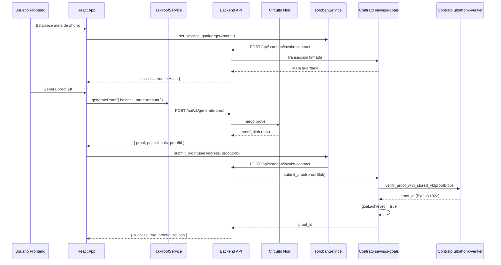

# 🔗 Guía de Integración: Savings Goals Contract con ZK Proofs

Esta guía explica cómo el contrato `savings-goals` usa ZK proofs y cómo conectar el frontend para interactuar con todas sus funciones.

---

## 📋 Flujo Completo de ZK Proofs



---

## 🎯 Cómo el Contrato Usa ZK Proofs

### 1. Estructura del Contrato

El contrato `savings-goals` almacena metas de ahorro y permite verificar su cumplimiento usando ZK proofs:

```rust
pub struct Goal {
    pub target_amount: i128,        // Meta de ahorro
    pub deadline_ts: Option<i64>,    // Fecha límite opcional
    pub achieved: bool,              // Si la meta fue lograda
    pub proof_id: Option<BytesN<32>>, // ID del proof ZK verificado
}
```

### 2. Flujo de Verificación ZK

Cuando un usuario envía un proof:

1. **Frontend genera proof**: Usa el circuito Noir para generar un proof que demuestra `balance >= target_amount` sin revelar el balance real.

2. **Frontend llama `submit_proof`**: Envía el `proof_blob` al contrato `savings-goals`.

3. **Contrato invoca verificador**: El contrato llama internamente al contrato `ultrahonk-verifier`:
   ```rust
   let proof_id = Self::invoke_verifier(&env, &verifier, proof_blob)?;
   ```

4. **Verificador valida**: El contrato `ultrahonk-verifier`:
   - Verifica el proof usando BN254
   - Calcula el Keccak256 del proof_blob
   - Retorna el `proof_id` (BytesN<32>)

5. **Contrato marca como lograda**: Si la verificación es exitosa:
   ```rust
   goal.achieved = true;
   goal.proof_id = Some(proof_id);
   ```

### 3. Funciones del Contrato

| Función | Descripción | Requiere Auth | Tipo |
|---------|-------------|---------------|------|
| `set_savings_goal` | Crea/actualiza meta de ahorro | ✅ Usuario | Transacción |
| `get_savings_goal` | Obtiene meta de un usuario | ❌ | Lectura |
| `submit_proof` | Envía proof ZK y marca meta como lograda | ✅ Usuario | Transacción |
| `set_verifier` | Configura dirección del verificador | ✅ Admin | Transacción |

---

## 🔌 Integración Frontend

### 1. Configuración Inicial

Agrega las variables de entorno en `.env`:

```env
VITE_SAVINGS_GOALS_CONTRACT=CDSYLJVCXZKXCTEGRFJXEWL4VYLN5HRZ5ILZ266PTKO3QU6GMK6EHXKD
VITE_STELLAR_NETWORK=testnet
VITE_BACKEND_URL=http://localhost:4000
```

### 2. Establecer Meta de Ahorro

```typescript
import { sorobanService } from '@/services/sorobanService';
import { useAuth } from '@/contexts/AuthContext';

const { user } = useAuth();

// Establecer meta de ahorro
const result = await sorobanService.setSavingsGoal({
  userAddress: user.walletAddress, // Dirección Stellar del usuario (G...)
  targetAmount: 1000, // Meta en la unidad base (ej: centavos)
  deadlineTs: Math.floor(Date.now() / 1000) + (30 * 24 * 60 * 60), // 30 días desde ahora
});

if (result.success) {
  console.log('Meta establecida:', result.txHash);
} else {
  console.error('Error:', result.error);
}
```

### 3. Obtener Meta de Ahorro

```typescript
// Obtener meta actual
const goal = await sorobanService.getSavingsGoal(user.walletAddress);

if (goal) {
  console.log('Meta:', {
    targetAmount: goal.target_amount,
    achieved: goal.achieved,
    proofId: goal.proof_id,
    deadline: goal.deadline_ts ? new Date(parseInt(goal.deadline_ts) * 1000) : null,
  });
} else {
  console.log('Usuario no tiene meta establecida');
}
```

### 4. Generar y Enviar ZK Proof

```typescript
import { zkProofService } from '@/services/zkProofService';
import { sorobanService } from '@/services/sorobanService';
import { useBalance } from '@/hooks/useBalance';

const { balance } = useBalance(); // Balance real del usuario
const goal = await sorobanService.getSavingsGoal(user.walletAddress);

if (!goal) {
  throw new Error('No hay meta establecida');
}

if (goal.achieved) {
  console.log('Meta ya fue lograda');
  return;
}

// Verificar que el balance sea suficiente
const targetAmount = parseInt(goal.target_amount);
if (balance < targetAmount) {
  throw new Error('Balance insuficiente para lograr la meta');
}

// 1. Generar proof ZK
const proofResult = await zkProofService.generateProof({
  balance,
  targetAmount,
});

// 2. Crear proof_blob (formato esperado por el verificador)
// El blob debe contener: fields (u32) + public_inputs + proof
const proofBlob = createProofBlob(proofResult);

// 3. Enviar proof al contrato
const verificationResult = await sorobanService.submitProofToSavingsGoals(
  user.walletAddress,
  proofBlob
);

if (verificationResult.verified) {
  console.log('✅ Meta lograda!', {
    proofId: verificationResult.proofId,
    txHash: verificationResult.txHash,
  });
} else {
  console.error('Error verificando proof:', verificationResult.error);
}
```

### 5. Función Helper para Crear Proof Blob

El `proof_blob` debe tener el formato que espera el verificador Ultrahonk:

```typescript
function createProofBlob(proofResult: ProofResult): string {
  // El formato depende de cómo el verificador espera recibir el proof
  // Generalmente: [fields_count (u32)] + [public_inputs] + [proof_bytes]
  
  const fields = proofResult.publicInputs.length;
  const fieldsBytes = Buffer.alloc(4);
  fieldsBytes.writeUInt32BE(fields, 0);
  
  const publicInputsBytes = Buffer.from(
    proofResult.publicInputs.join(','),
    'utf-8'
  );
  
  const proofBytes = Buffer.from(
    proofResult.proof.replace('0x', ''),
    'hex'
  );
  
  const blob = Buffer.concat([
    fieldsBytes,
    publicInputsBytes,
    proofBytes
  ]);
  
  return '0x' + blob.toString('hex');
}
```

---

## 🔧 Backend: Invocación de Contratos Soroban

El backend implementa el endpoint `/api/soroban/invoke-contract` que:

1. **Convierte argumentos a XDR**: Los valores JavaScript se convierten al formato XDR que espera Soroban.

2. **Maneja autenticación**: Para funciones que requieren `require_auth`, obtiene la secret key del usuario desde Supabase.

3. **Simula transacciones**: Antes de enviar, simula la transacción para detectar errores.

4. **Firma y envía**: Firma la transacción con la secret key del usuario y la envía a la red.

### Variables de Entorno del Backend

```env
# Soroban RPC
SOROBAN_RPC_URL=https://soroban-testnet.stellar.org
STELLAR_NETWORK=testnet

# Supabase (para obtener secret keys)
SUPABASE_URL=https://tu-proyecto.supabase.co
SUPABASE_SERVICE_ROLE=tu-service-role-key
ENCRYPTION_KEY=tu-clave-de-encriptacion
```

### Ejemplo de Request

```json
{
  "contractAddress": "CDSYLJVCXZKXCTEGRFJXEWL4VYLN5HRZ5ILZ266PTKO3QU6GMK6EHXKD",
  "function": "submit_proof",
  "args": [
    "GCRHEPSAZUV7X5BKRZI4PQY4JK46DKVTU7TYKUUPPXJ5RM62Q23Q7TGZ",
    "0x1234abcd..."
  ],
  "network": "testnet",
  "userId": "uuid-del-usuario"
}
```

---

## 📝 Ejemplo Completo: Componente React

```typescript
import React, { useState, useEffect } from 'react';
import { sorobanService } from '@/services/sorobanService';
import { zkProofService } from '@/services/zkProofService';
import { useAuth } from '@/contexts/AuthContext';
import { useBalance } from '@/hooks/useBalance';

export const SavingsGoalComponent: React.FC = () => {
  const { user } = useAuth();
  const { balance, refreshBalance } = useBalance();
  const [goal, setGoal] = useState<SavingsGoal | null>(null);
  const [loading, setLoading] = useState(false);
  const [error, setError] = useState<string | null>(null);

  // Cargar meta al montar
  useEffect(() => {
    if (user?.walletAddress) {
      loadGoal();
    }
  }, [user?.walletAddress]);

  const loadGoal = async () => {
    try {
      const goalData = await sorobanService.getSavingsGoal(user.walletAddress);
      setGoal(goalData);
    } catch (err: any) {
      console.error('Error cargando meta:', err);
    }
  };

  const handleSetGoal = async (targetAmount: number) => {
    setLoading(true);
    setError(null);
    
    try {
      const result = await sorobanService.setSavingsGoal({
        userAddress: user.walletAddress,
        targetAmount,
        deadlineTs: Math.floor(Date.now() / 1000) + (30 * 24 * 60 * 60),
      });

      if (result.success) {
        await loadGoal(); // Recargar meta
      } else {
        setError(result.error || 'Error estableciendo meta');
      }
    } catch (err: any) {
      setError(err.message);
    } finally {
      setLoading(false);
    }
  };

  const handleSubmitProof = async () => {
    if (!goal || goal.achieved) {
      setError('Meta no disponible o ya lograda');
      return;
    }

    setLoading(true);
    setError(null);

    try {
      const targetAmount = parseInt(goal.target_amount);
      
      if (balance < targetAmount) {
        setError('Balance insuficiente');
        return;
      }

      // Generar proof
      const proofResult = await zkProofService.generateProof({
        balance,
        targetAmount,
      });

      // Crear proof blob
      const proofBlob = createProofBlob(proofResult);

      // Enviar al contrato
      const result = await sorobanService.submitProofToSavingsGoals(
        user.walletAddress,
        proofBlob
      );

      if (result.verified) {
        await loadGoal(); // Recargar meta
        await refreshBalance(); // Actualizar balance
        alert('✅ Meta lograda!');
      } else {
        setError(result.error || 'Error verificando proof');
      }
    } catch (err: any) {
      setError(err.message);
    } finally {
      setLoading(false);
    }
  };

  return (
    <div>
      {goal ? (
        <div>
          <h3>Meta de Ahorro</h3>
          <p>Objetivo: {goal.target_amount}</p>
          <p>Lograda: {goal.achieved ? '✅' : '❌'}</p>
          {goal.proof_id && <p>Proof ID: {goal.proof_id}</p>}
          
          {!goal.achieved && balance >= parseInt(goal.target_amount) && (
            <button onClick={handleSubmitProof} disabled={loading}>
              {loading ? 'Generando proof...' : 'Demostrar Meta Lograda'}
            </button>
          )}
        </div>
      ) : (
        <div>
          <p>No hay meta establecida</p>
          <button onClick={() => handleSetGoal(1000)} disabled={loading}>
            Establecer Meta
          </button>
        </div>
      )}
      
      {error && <p style={{ color: 'red' }}>{error}</p>}
    </div>
  );
};
```

---

## ✅ Checklist de Integración

- [x] Contrato `savings-goals` desplegado en testnet
- [x] Servicio `sorobanService` actualizado con métodos específicos
- [x] Backend implementado para invocar contratos Soroban
- [ ] Contrato `ultrahonk-verifier` desplegado y configurado
- [ ] Frontend integrado con servicios
- [ ] Pruebas end-to-end del flujo completo

---

## 🔗 Referencias

- [Stellar Smart Contracts Documentation](https://developers.stellar.org/docs/smart-contracts)
- [Soroban SDK Reference](https://soroban.stellar.org/docs)
- [Noir Documentation](https://noir-lang.org/docs/)

