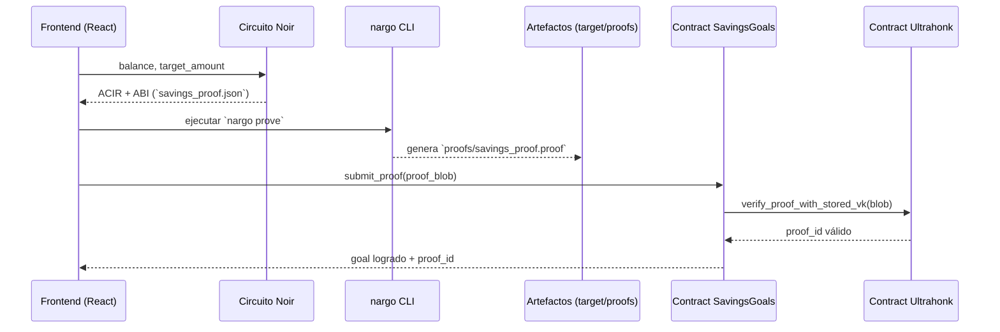

# 🛡️ ZK Savings Proofs – PumaPay

Este módulo conecta los circuitos Noir (`circuits/savings-proof`) con los contratos Soroban (`savings-goals` + `ultrahonk-verifier`) para demostrar metas de ahorro sin revelar saldos reales.

---

## ⚙️ Flujo de Alto Nivel

```mermaid
flowchart LR
    A[Usuario PumaPay] -->|1. Balance local| B[Noir Circuit<br>savings-proof]
    B -->|2. `nargo compile`| C[target/savings_proof.json]
    C -->|3. Inputs (Prover.toml)| D[/nargo prove/]
    D -->|4. `proofs/savings_proof.proof`| E[Empaquetar blob<br>(fields + proof)]
    E -->|5. submit_proof| F[SavingsGoals Contract]
    F -->|invoke_contract| G[UltraHonk Verifier]
    G -->|Keccak proof_id| F
    F -->|Eventos / estado| H[Backend + DeFindex]
    H -->|Rankings / badges| A
```

1. El frontend calcula el balance/objetivo y alimenta el circuito Noir.
2. `nargo prove` genera `public_inputs` y `proof` (Barretenberg) + `proof_blob`.
3. `savings-goals::submit_proof` envía `proof_blob` al contrato verificador.
4. `ultrahonk-verifier` valida el proof (BN254) y devuelve `proof_id`.
5. `savings-goals` marca la meta como lograda y puede emitir eventos para DeFindex.

---

## 📁 Artefactos Noir

| Archivo | Descripción |
|---------|-------------|
| `circuits/savings-proof/Nargo.toml` | Metadata de paquete (`type = "bin"`) y dependencias. Sí, **es obligatorio** para que `nargo` reconozca el proyecto. |
| `circuits/savings-proof/Prover.toml` | Inputs por defecto (`balance`, `target_amount`) para `nargo prove`. |
| `circuits/savings-proof/src/main.nr` | Circuito: verifica `balance >= target_amount` (tipo `u64`) y expone `balance - target`. |
| `circuits/savings-proof/target/savings_proof.json` | ABI + bytecode ACIR utilizados por el frontend (`@noir-lang/noir_js`). |
| `circuits/savings-proof/proofs/savings_proof.proof` | Ejemplo de proof generado (hex). |

**Comandos clave**

```bash
cd circuits/savings-proof
/Users/gerryp/.nargo/bin/nargo compile   # genera target/savings_proof.json
/Users/gerryp/.nargo/bin/nargo prove     # usa Prover.toml y crea proofs/savings_proof.proof
```

## 🧬 Diagrama del circuito y pruebas ZK



---

## 🧠 Detalle del contrato `savings-goals`

| Función | Propósito |
|---------|-----------|
| `set_verifier(verifier: Address)` | Solo el admin (primera cuenta) puede definir qué contrato `ultrahonk-verifier` validarà los proofs. |
| `set_savings_goal(target_amount, deadline_ts)` | El usuario crea/actualiza su meta; rechaza valores ≤ 0 y guarda la estructura `Goal`. |
| `get_savings_goal(user)` | Lectura pública para dashboards/DeFindex. Devuelve `Goal` completo (meta, deadline, proof_id, etc.). |
| `submit_proof(proof_blob)` | Recibe `(u32 fields || public_inputs || proof)`, llama al verificador y marca `achieved=true` guardando el `proof_id`. |
| `assert_admin` + helpers | Lógica interna para asegurar que existe un admin y que solo él puede cambiar el verificador. |

**Estructura almacenada**

```rust
pub struct Goal {
    target_amount: i128,
    deadline_ts: Option<i64>,
    achieved: bool,
    proof_id: Option<BytesN<32>>,
}
```

---

## 🔌 Cómo se enlaza con la app

1. **Frontend (React/TypeScript)**
   - Usa `@noir-lang/noir_js` + `@noir-lang/backend_barretenberg`.
   - Carga `src/zk/savings_proof.json` y genera proofs dinámicos.
   - Llama a `/api/savings-goals/proof` (o directamente al contrato via wallet) con el `proof_blob`.

2. **Backend / DeFindex**
   - Escucha eventos o consulta `Goal` para agregar datos anónimos.
   - Usa `proof_id` como identificador no correlacionable.

3. **Contratos Soroban**
   - `savings-goals` gestiona metas y delega ZK a `ultrahonk-verifier`.
   - `ultrahonk-verifier` implementa la lógica BN254/Keccak (copiada del repo oficial `indextree/ultrahonk_soroban_contract`).

---

## ✅ Checklist de Integración

- [x] Diagrama principal y flujo de circuito renderizado con bloques Mermaid (asegúrate de que el visor de tu IDE o GitHub soporte bloques ```mermaid```).
- [x] Circuito Noir compila (`nargo compile`).
- [x] Proof ejemplo generado (`nargo prove` → `proofs/savings_proof.proof`).
- [x] `savings-goals` y `ultrahonk-verifier` compilados a Wasm.
- [ ] Servicio `zkProofService.ts` en el frontend (pendiente).
- [ ] Eventos/exports a DeFindex (pendiente tras ZK end-to-end).

Con esto tienes una guía completa de cómo funcionan los savings proofs en ZK dentro de PumaPay y cómo se conectan todas las piezas.

